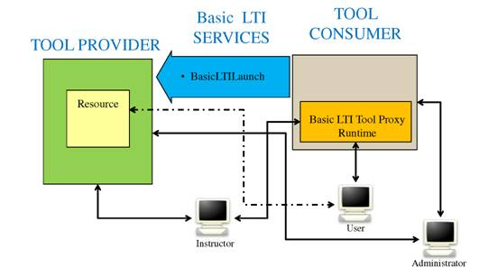

# The Rails Backend

## The Need for a Web Application
The JavaScript which powers the autograding works entirely client-side, meaning as long as you have the test files, there's no need for an internet connection. This path was chosen for two reasons:

* Snap<em>!</em> is client-side, and evaluating Snap<em>!</em> projects on a server would require a significant amount of work.
* edX provides a custom problem type called "JSInput" {{ "jsinput-docs" | cite }} which gave us a clear path for integration with edX.
* Developing an autograder and a web application required more resources than were available.

While the entirely client-side path was a good decision, we ran into a number of issues by relying on `JSInput` and trying to keep all features client-side.

### Challenges with `JSInput`
edX's `JSInput` problem type provides a JavaScript API for sending scores to the edX platform. It allows us to build in a custom version of Snap<em>!</em> alongside the rest of the content in edX.

However, we encountered several problems while developing the `JSInput` based integration:

* Developing code was very slow! Changes to code required manually uploading a new file to edX, which is a multi-step process. The libraries used for JSInput swallowed native JavaScript errors, making debugging nearly impossible.
* The edX interface has it's own mechanism for a "Check" button and showing feedback. Communicating the detailed output from the autograder didn't work very well, and we ended up developing many work arounds to get a seamless UI.
* There's no room for storing or retrieving user metadata. We rely on features that allow students to recall previous submissions. Through `JSInput` the only option for these features were to use the browser's `LocalStorage` API. This API has limits, like a max of 5MB of storage, that caused problems for some students.
* Furthermore, without a dedicated database, every single test file written had lots of hard-coded metadata that was repetitive and prone to error.
* While edX provides user logs for the entire course, we found dealing with these logs to be needlessly complex. They are slow to get, and the autograder results are difficult to separate from the rest of the course data. As such, we haven't analyzed the edX data to the extent we'd like to. A simpler logging system described below has been immensely helpful for our analysis.

The one benefit of these problems was that it forced the development of the autograder into two components: A JS interface to edX, and a "dumb" client-side component that sits on top of Snap<em>!</em>. This distinction was helpful when adapting the autograder to work with the new web application.

Perhaps most importantly: the grading system could only work with edX. CS10 uses Canvas {{ "canvas" | cite }} as it's LMS, and many high schools use different systems. The need to build a custom solution for every platform would be prohibitively expensive. Fortunately, the LTI protocol provides a decent solution for most of the tasks we'd like to accomplish.

At the end of the day, the decision to build an initial version tied to `JSInput` was a good one, as it was still probably faster than building a full web application at the same time.

## Basic Architecture
λ is a Ruby on Rails "ROR" {{ "ror" | cite }} web application backed by a PostgreSQL database. The database primarily contains a set of questions, a submissions log, and a users table, as well as some additional metadata. The current version is deployed to Heroku at [lambda.cs10.org](https://lambda.cs10.org), but it could be deployed to any cloud provider.

### Questions and Submissions
The core application is supported by two, fairly simple, data models: `Question`s and `Submission`s.

A **`Question`** needs only three attributes:

* `title`: A human-readable ID for the question
* `points`: Points are used to normalize scores. (See the LTI section below.)
* `test file`: The test file is a JavaScript file (described below) which includes the test cases as well as feedback presented to the student.

Though they aren't currently used, future updates for will make use of the following properties:

* `content`: Currently, it is up to course staff to provide context for the questions which are being graded. In the future, the λ will display this content alongside the Snap<em>!</em> interface.
* `tags`: Questions can contain tags which can aid in searching, or trying to correlate student performance across problems. There is also potential for using tags to recommend problems to students as a study tool.

A **`Submission`** has a few key properties:

* `test results` is a JSON-formatted result from the autograder. It contains the points given to each test case as well as the specific results and feedback.
* `code submission` is a full export of the Snap<em>!</em> that students wrote.
* `user info` is a set of data about the submitting user which includes what source they came from (see the accounts section), and if they're a part of a course.

Note that logging submissions is purely for purposes of analysis and backup. By implementing the LTI protocol, the LMS will contain all necessary data for students to receive grades. However, if we choose to adapt λ to include resources for studying or question recommendation, the internal submissions database will become more important.

A **`Course`** is an object which manages the LTI connection, and needs only two values:

* `consumer_key` is a unique key for each course. This helps the application separate between different LTI consumers, primarily for purposes of analysis.
* `consumer_secret` is a hash of the `consumer_key`. It's automatically generated by the application when a Course object is created.

Note that the `Course`s table isn't entirely necessary. The LTI connection's `key` and `secret` values *could* be entirely static (i.e. in an environment configuration), but such an approach is prone to errors and has security concerns as an application is connected to multiple systems.

### User Identities
When building a tool with grading data, it was critically important that we had an easy and way to identify students, and to minimize the need for an additional login.

#### LTI
The _IMS Global Learning Consortium_ {{ "ims" | cite }} is a standards body composed of educational instituions, intrest bodies and edtech companies. IMS publishes a specification called LTI {{ "lti" | cite }} which can briefly be described as "OAuth for educational applications". The LTI authentication process is actually based on the OAuth {{ "oauth" | cite }} protocol, but it's designed to be completely seamless for students. (Unlike a Google or Facebook authorization, a student who is already authenticated inside a LMS does not need to specifically 'authorize' an application when LTI is used.)

The LTI protocol defines two "categories" of applications: a `Tool Consumer` (TC) and a `Tool Provider` (TP). λ is a provider, while the LMS is a typical consumer, in this case bCourses (Berkeley's instance of Instructure Canvas). A typical user flow involves a student visiting an assignment page (inside a LMS)
which contains either an `iframe` element or a special link. Currently, λ implements version 1.1 {{ "lti-1.1" | cite }}  of the LTI specification, though support for version 2.0 {{ "lti-2.0" | cite }}  is planned.  LTI 1.1 only allows a tool provider to read and send grades for a currently logged in student, so λ must work within this limitation. LTI 2.0 will potentially allow for more data about courses to be shared with students (such as handling parter assignments), but it so far not well supported among LMS vendors.

When a user clicks the link (or an embedded `iframe` is displayed), a HTTP `POST` request is make to the provider which includes application-level configuration data (including a `consumer_key` and `consumer_secret`). The challenge is that the current version of the LTI protocol requires that this `launch_url` be the same for every assignment. (In this case the URL is `https://lambda.cs10.org/lti/sessions`.)
After completing the OAuth handshake, the TP (our application) checks for the presence of additional configuration info passed by the TC:

* If a `question_id` is provided, then λ will load the specific question. Currently LTI doesn't provide a standard interface for loading a specific resource, so if an instructor passes in this value, students will automatically be redirected to the proper question.
* A grade passback URL is optional. If the application sees this URL, it will post a score back to the TC. If the URL is missing, then λ skips posting a score but still saves the submission to the local database.
* User Info: If the instructional staff choose to, they can configure the LMS to send "Public" information to λ. (Public here means, what FERPA defines are directory information. In the case of UC Berkeley, this includes the student's name, email, and user ID, specifically different from their student ID. **REF?**) If the TC doesn't send public information, then it will send an obfuscated hash to identify each student. Again, this primarily only affects the analysis capabilities provided to TAs. 

#### Need For (Regular) OAuth
Unfortunately, despite the advantages of LTI, we found that traditional OAuth was still a necessary component. The primary motivation was the need for site admins, and TAs who can login without having to go through a LMS. We're using Google as an OAuth provider in addition to LTI. In the future, we would also like to connect the Snap<em>!</em> cloud account system through OAuth, but this is waiting on enhancements to the Snap<em>!</em> cloud.

This feature can be useful for students as well, once we build out student dashboards. However, in order to be effective, we'll need a way to associate LTI accounts with OAuth accounts. Though not fully implemented, we will be able to automatically associate accounts for students if they share the same email address. For campuses setup like Berkeley, this will the default case for most students since their Google account and the LMS account originate from the same campus systems. If the emails don't automatically match, we should be able to provide this functionality by emailing activation codes. 

## Security Concerns
Finally, we need to discuss a significant concern about security. Currently, the autograder test files are implemented in plain JavaScript, and are served alongside the rest of the page content. This means there's a fairly gaping hole allowing for Cross-Site-Scripting (XSS) vulnerabilities. The current mitigating factor is that only trusted accounts with an admin flag can upload test cases. This is an acceptable limitation for now, but in the [Future Work](./future-work.md) chapter we describe a potential way around this by allowing test cases to be written in Snap<em>!</em>, then securely complied to JS on the serverside.

