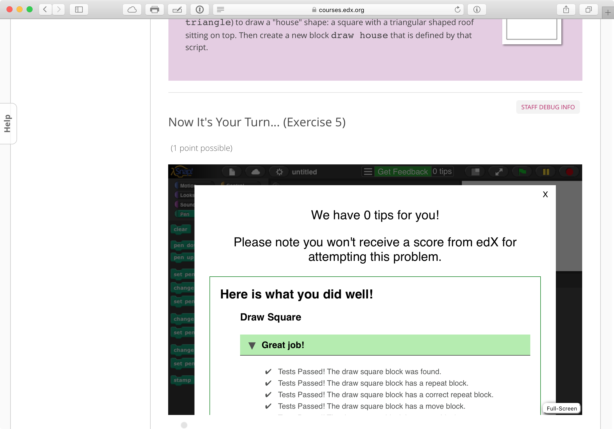
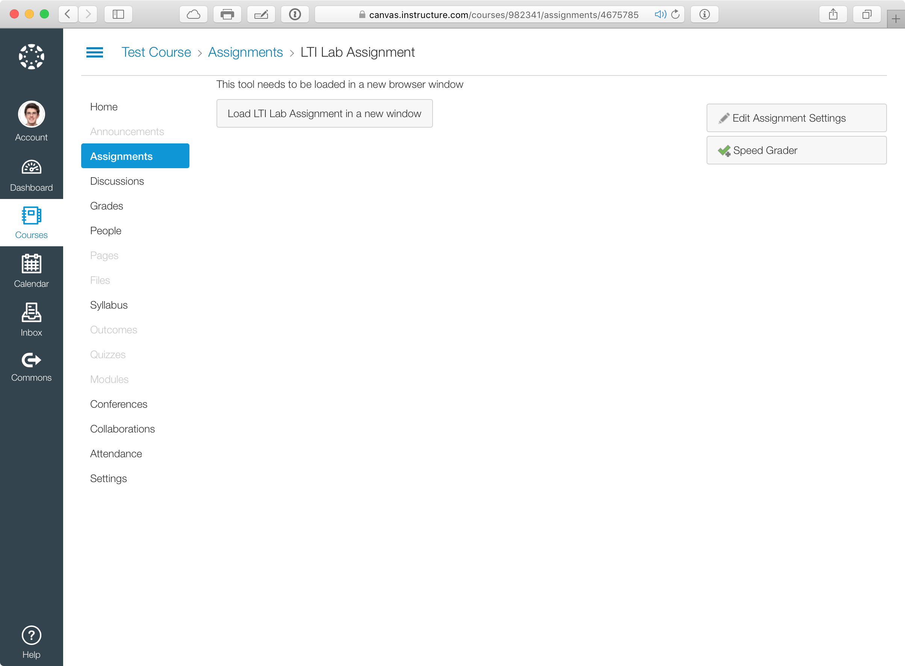

# Implementation

The λ web application is built using the Ruby on Rails framework {{ "ror" | cite }}, and makes use of many common web technologies. The Snap<em>!</em> interface is implemented purely in JavaScript. The initial purpose of the system is not to be a grade storage but to connect with an existing gradebook or Learning Management System (LMS) so that any grade results will be integrated with the rest of course data. We chose this route because, in our experience multiple sources of grades are prone to errors and delays. By designing a system which doesn't _need_ to store grade data, we can make a lot of simplifications and focus on more important features.

## The Need for a Web Application
The JavaScript which powers the autograding works entirely client-side, meaning as long as you have the test files, there's no need for an internet connection. This path was chosen for two reasons:

* Snap<em>!</em> is client-side, and evaluating Snap<em>!</em> projects on a server would require a significant amount of work.
* edX provides a custom problem type called "JSInput" {{ "jsinput-docs" | cite }} which gave us a clear path for integration with edX.
* Developing an autograder and a web application required more resources than were available.

While the entirely client-side path was a good decision, we ran into a number of issues by relying on `JSInput` and trying to keep all features client-side.

### Challenges with `JSInput`
edX's `JSInput` problem type provides a JavaScript API for sending scores to the edX platform. It allows us to build in a custom version of Snap<em>!</em> alongside the rest of the content in edX.

However, we encountered several problems while developing the `JSInput` based integration:

* Developing code was very slow! Changes to code required manually uploading a new file to edX, which is a multi-step process. The libraries used for JSInput swallowed native JavaScript errors, making debugging nearly impossible.
* The edX interface has it's own mechanism for a "Check" button and showing feedback. Communicating the detailed output from the autograder didn't work very well, and we ended up developing many work arounds to get a seamless UI.
* There's no room for storing or retrieving user metadata. We rely on features that allow students to recall previous submissions. Through `JSInput` the only option for these features were to use the browser's `LocalStorage` API. This API has limits, like a max of 5MB of storage, that caused problems for some students.
* Furthermore, without a dedicated database, every single test file written had lots of hard-coded metadata that was repetitive and prone to error.
* While edX provides user logs for the entire course, we found dealing with these logs to be needlessly complex. They are slow to get, and the autograder results are difficult to separate from the rest of the course data. As such, we haven't analyzed the edX data to the extent we'd like to. A simpler logging system described below has been immensely helpful for our analysis.

The one benefit of these problems was that it forced the development of the autograder into two components: A JS interface to edX, and a "dumb" client-side component that sits on top of Snap<em>!</em>. This distinction was helpful when adapting the autograder to work with the new web application.

Perhaps most importantly: the grading system could only work with edX. CS10 uses Canvas {{ "canvas" | cite }} as it's LMS, and many high schools use different systems. The need to build a custom solution for every platform would be prohibitively expensive. Fortunately, the

## Basic Architecture
λ is a Ruby on Rails "ROR" {{ "ror" | cite }} web application backed by a PostgreSQL database. The database primarily contains a set of questions, a submissions log, and a users table, as well as some additional metadata. The current version is deployed to Heroku at [lambda.cs10.org](https://lambda.cs10.org), but it could be deployed to any cloud provider.

### Questions and Submissions
The core application is supported by two, fairly simple, data models: `Question`s and `Submission`s.

A `Question` needs only three attributes:

* `title`: A human-readable ID for the question
* `points`: Points are used to normalize scores. (See the LTI section below.)
* `test file`: The test file is a JavaScript file (described below) which includes the test cases as well as feedback presented to the student.

Though they aren't currently used, future updates for will make use of the following properties:

* `content`: Currently, it is up to course staff to provide context for the questions which are being graded. In the future, the λ will display this content alongside the Snap<em>!</em> interface.
* `tags`: Questions can contain tags which can aid in searching, or trying to correlate student performance across problems. There is also potential for using tags to recommend problems to students as a study tool.

A `Submission` has a few key properties:

* `test results` is a JSON-formatted result from the autograder. It contains the points given to each test case as well as the specific results and feedback.
* `code submission` is a full export of the Snap<em>!</em> that students wrote.
* `user info` is a set of data about the submitting user which includes what source they came from (see the accounts section), and if they're a part of a course.

Note that logging submissions is purely for purposes of analysis and backup. By implementing the LTI protocol, the LMS will contain all necessary data for students to receive grades. However, if we choose to adapt λ to include resources for studying or question recommendation, the internal submissions database will become more important.

### User Identities
#### LTI
The _IMS Global Learning Consortium_ {{ "ims" | cite }} is a standards body composed of educational instituions, intrest bodies and edtech companies. IMS publishes a specification called LTI {{ "lti" | cite }} which can briefly be described as "OAuth for educational applications".

The LTI protocol defines two "categories" of applications: a `Tool Consumer` (TC) and a `Tool Provider` (TP). λ is a provider, while the LMS is a typical consumer, in this case bCourses (Berkeley's instance of Instructure Canvas). A typical user flow involves a user in a TC clicking on a link which opens up a TP. When this link is clicked, the TC can pass a unique URL to the TP, as well as a custom user ID. This URL allows the TP to make a `POST` request with grading data.

#### Need For (Regular) OAuth

## Security Concerns
...
	* edX JS Input
	* Moving to LTI
	* Dedicated Database
		* Simpler JS Test

* Lambda Walkthrough
	* Student's Perspective
	* Configuring An Application
	* Writing Tests