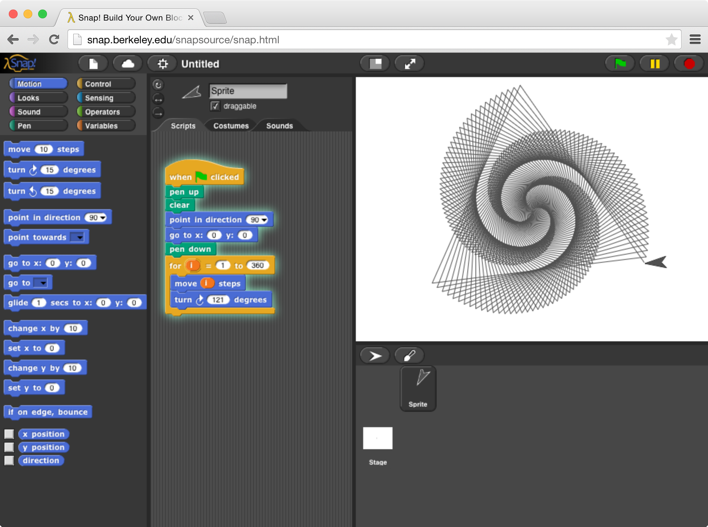
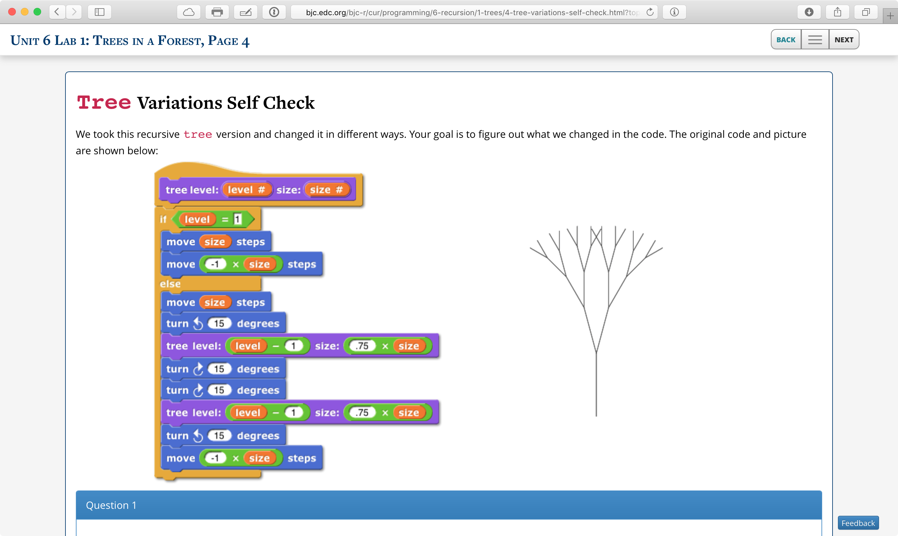

# Introduction

In recent years, the field computer science (CS), and the broader technology industry, have undergone significant changes, though not simply technical ones. Around the same that same time from that enrollments started booming {{ "cra-blog" | cite }}, the National Science Foundation (NSF) posted the original solicitation for _Broadening Participation in Computing_ {{ "nsf-bpc" | cite }}. As a result of the efforts to improve diversity in CS, curricula such as _Exploring Computer Science_ {{ "ecs" | cite }} (ECS), and _AP Computer Science Principles_ {{ "apcsp" | cite }}. (AP-CSP) have emerged. A central component of these new curricula includes the ability to use visual programming languages (VPLs) to teach CS. As great as these tools can be to teach programming, the often lack infrastructure found in more traditional environments (such as Python and Java). This lack on infrastructure can make courses more difficult to teach and scale {{ "REF TODO" | cite }}.

A critical example of missing infrastructure is the capability to automatically evaluate code, and send the results to another process. Automatic evaluation, and distributing the results are central components in an _autograder_. Without an autograder, it can be difficult (or simply costly) teach large online courses. During the 2015-2016 school year, we taught _The Beauty and Joy of Computing_ {{ "bjc" | cite }}  (BJC) a series of four _massive open online courses_ (MOOCs) on edX {{ "edx" | cite }}. BJC is an AP CS Principles course that uses Snap<em>!</em> as its primary language. Without an autograder, we didn't think that we could fairly give credit to students online. In addition, BJC is offered at UC Berkeley as CS10 would be able to make use of an autograder for Snap<em>!</em>.

We developed λ as a system for autograding Snap<em>!</em> {{ "snap" | cite }}. λ is composed of two main parts, the Ruby on Rails application server, and a Javascript application that augments Snap<em>!</em> with testing, analysis and logging capabilities. While the grading interface was developed for edX, this report will describe some of the design challenges we encountered over the past year as well as future directions for research and experimentation.

## Snap<em>!</em>
Snap<em>!</em> is inspired by MIT's Scratch {{ "scratch" | cite }}, but adapted for university-level courses by including features such as first-class lists and functions. Snap<em>!</em> is implanted as a web application in Javascript.

## The Beauty and Joy of Computing
The Beauty and Joy of Computing is a introduction to computing designed to broaden participation among underrepresented groups. The primary language used is Snap<em>!</em>, and many of the exercises in the course have visual outputs. The course functions and abstractions, covers recursion, higher order functions (lambdas) and many other topics. Many of the examples and exercises in BJC have multiple paths to implementation, which can be a challenge for autograders to correctly handle.

## CS10
CS10 {{ "cs10" | cite }}  is UC Berkeley's offering of BJC. Currently, CS10 is offered every semester to around 200-300 students. Like many other introductory courses, CS10 relies heavily on laboratory sections as the primary method for students to learn to program. (However, programming is of course covered in lecture and discussion or 'recitation' sections.) λ will be used in CS10 during lab sections to give students better feedback as they're working as well as to give credit for the assigned lab work. This year, we were able to trial the system for three of the 14 labs that students completed in Snap<em>!</em>.
