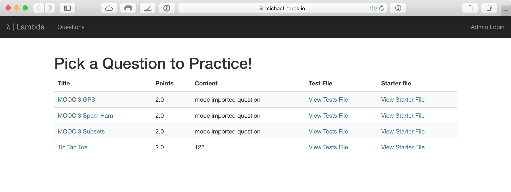

# Walkthrough

λ is composed of two parts: a webserver and a Snap<em>!</em> interface with autograding capabilities. In the current implementation, only instructors need to use the webserver, though in the future there may be functionality added for students. (See the [future work](future-work.md) section.)

## Web Application

The basic web interface presents a list of problems to try. This list is public, so anyone can attempt any problem, but instructors are expected to embed specific questions with their directions. 

There will be a more thorough description the [documentation](../docs/README.md).