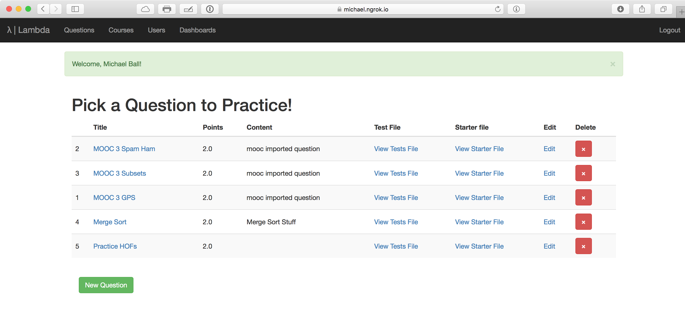

# Walkthrough

λ is composed of two parts: a webserver and a Snap<em>!</em> interface with autograding capabilities. In the current implementation, only instructors need to use the webserver, though in the future there may be functionality added for students. (See the [future work](future-work.md) section.)

## Web Application

The basic web interface presents a list of problems to try. This list is public, so anyone can attempt any problem, but instructors are expected to embed specific questions with their directions. Users can click on a link to work on a particular question.

The rest of the interest options come after the user has logged in with an admin account.

These features are:

* Creating / Editing Questions
	* A question contains a test file, a points value, and a starter file.
* Creating / Editing Courses
	* Courses describe connections to the LMS. Each course has a key, and some policy settings.
* Creating / Editing Admin Dashboards
	* Admin dashboards provide status for how students are doing. This initial version is based entirely on custom SQL queries, but they can be powerful. 

## Snap<em>!</em> Interface

There will be a more thorough description the [documentation](../docs/README.md).