# Results
Over the course of three lab assignments, we found that students used the autograder to complete labs outside of course time. While we have no basis for when (or how often) students completed labs at home without the autograder, this shows that students are at least receiving the benefits of feedback when a TA is not present.

Secondly, when we surveyed students, they were almost evenly split between preferring oral lab checkoffs or the autograder. Given the lab setup, and the differing advantages for each environment, this is what we would hope for.

*Note*, unlike other educational studies, we are *not* trying to claim any learning gains from this system.

<!--
	Do we need to prove that feedback is beneficial?
-->
## Usage & Statistics
The first part of our analysis will be to look at how often and when students were submitting their labs. This data was obtained from aggregate information in the λ Submissions database as well as from bCourses to compare to non-autograded labs.

### Basic Statistics

* Total Number of students in CS10: 169
* Total Number of student using the autograder: 145 (86%)

| Lab # | Oral Checkoffs | Autograder Checkoffs |
| ------| -------------- | -------------------- |
| 10	| 145			 | N/A					|
| 11	| 34			 | 133					|
| 12	| 57			 | 80					|
| 13	| 132			 | N/A					|
| 14	| 97			 | 64					|
| 15	| 142			 | N/A					|

Note this data has some anomalies due to bug in the initial setup, and confusion among course staff:

* Lab 11 had a bug posting scores through LTI for the first day. Some TA's mistakenly submitted scores twice.
* Lab 14 had a bug in one exercise causing many students to get checked off by both methods.

We can look at the number of times that students tried the autograder:

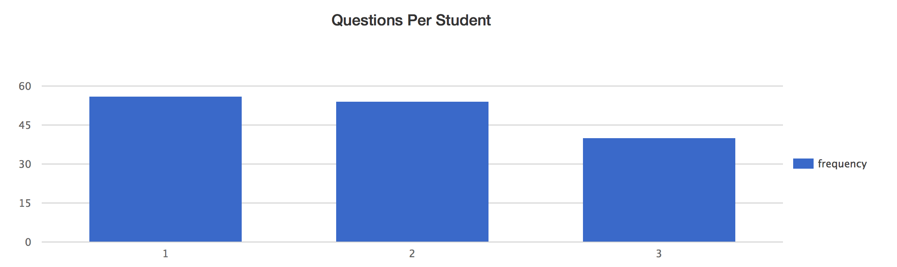

What this shows us is that, though students were only required to complete one lab using the autograder, nearly 2/3 (93/149) found the autograder compelling enough to try a second time. From talking to students and staff, a portion of the drop off in students using the autograder may be due to the fact that the autograder doesn't handle pairs of students. Given that the later labs are some of the more difficult, many students may choose to work in pairs.

#### Submission Times
The second thing to look at is _when_ students are submitting their work. While we certainly still want students to attend lab, improving the "at home" experience for students would be a significant benefit. Here, we see that students are choosing to use the autograder at home, with usage patterns that you would expect from undergraduates.

These charts show the overall submission times for each of the three labs. The red bar indicates the date that the lab was due for full credit.

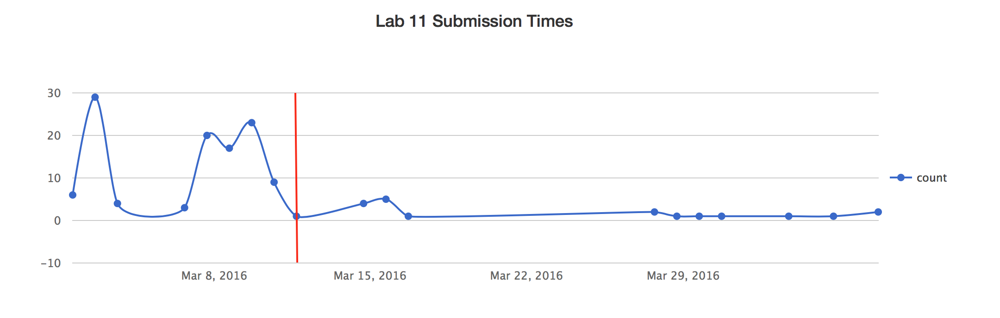

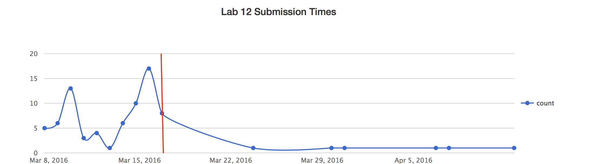

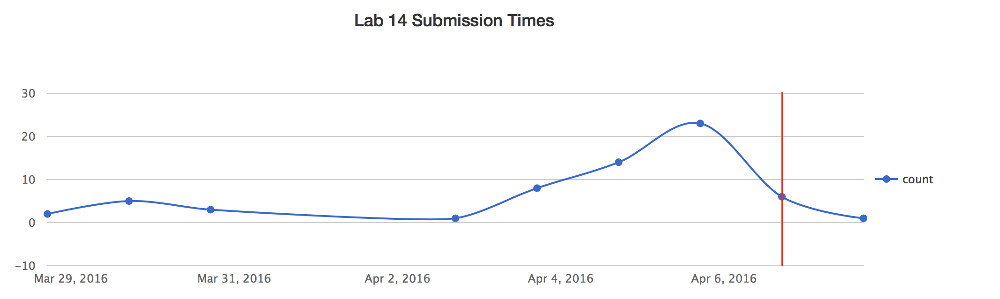

These graphs don't reveal anything too surprising. Mostly, students are using the autograder to complete labs at the same pace they normally would.

We can look at the days of the week as well as the time of day to see when students are working on labs. Normal lab times are usually between 9:00-19:00, though this varies by the day of the week.

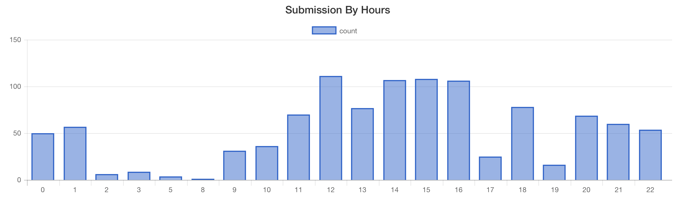

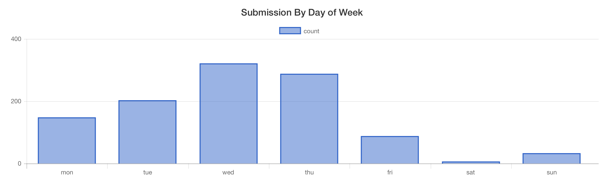

Again, these graphs are fairly close to what course staff would expect. Most students are continuing to complete labs during their scheduled time, but a significant number are working at home.

### Time Savings
While time savings are not a primary motivation for this work, we should consider the potential benefits that could be saved be allowing students to get checked off using the autograder. Anecdotally, oral lab checkoffs take between 2 to 10 minutes to complete, with the average time somewhere around 3 to 4 minutes. The current usage patterns (as well as the results in the next section), suggest that we can expect 33%-50% of students to use the autograder. 

If we have 15 labs which use Snap<em>!</em>, and 150 students completing labs, and assume that a lab checkoff takes 3 minutes: 33% of students the autograder would free up approximately 38 hours of TA time. (This is slightly under 30% of the total workload for a single 8 hour per week TA appointment at Berkeley.)

However, if we have 15 labs which use Snap<em>!</em>, and 300 students completing labs, and assume that a lab checkoff takes 4 minutes: 50% of students the autograder would free up approximately 150 hours of TA time. (This is 110% of the total workload for a single 8 hour per week TA appointment at Berkeley.)

### Submission Patterns
We can also look at how often students attempt each question. This shows whether students are using the autograder more as a feedback tool, as a crutch or as simply a credit mechanism. While there's no clear exact number of times a student should use submit their work, it's clear that we want an overall 'happy-medium'. 

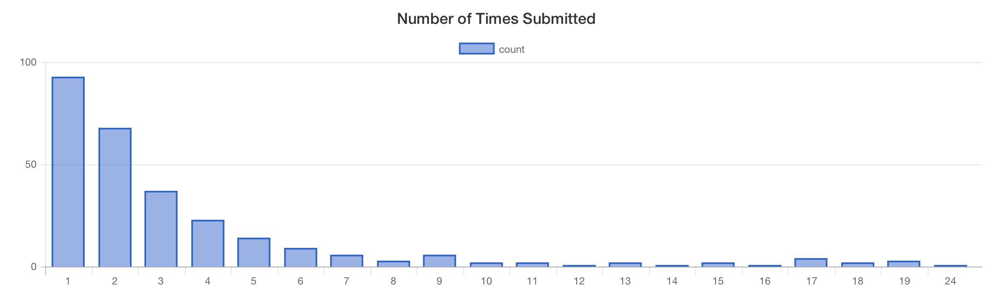

The data show that most students appear to be submitting only once, meaning they're not currently getting much benefit by the feedback presented. If there were more feedback presented, or potentially more challenging questions this might change. Though not yet implemented, non-graded feedback such as code quality suggestions might change the way students work to use the autograder. 

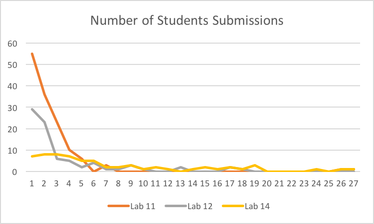

These results also how a really long tail for the number of submissions by some students. This is to be expected with any autograder. However, from looking at the data, and from TA reports many of these high submission numbers may be due to the previously mentioned bugs. (Students tried submitting many times simply hoping that the errors would disappear.)

However, the difference in attempts for Lab 14 is pretty clear. While most students still only submitted a few number of times, there is a much wider diversity in the number of questions. The number of blocks graded for lab 14 was 4 compared to the 1 or 2 for labs 11 and 12. 

## Survey Feedback & Analysis
Along with the data we collected, we surveyed students at two points to get feedback about their use of the autograder. The first survey occurred during the CS10 midterm, shortly after students should have completed labs 11 and 12. The second survey was given along with the final exam, at the end of the semester.

### Midterm Feedback
The first question we asked students was whether they preferred online lab checkoffs or oral lab checkoffs. 

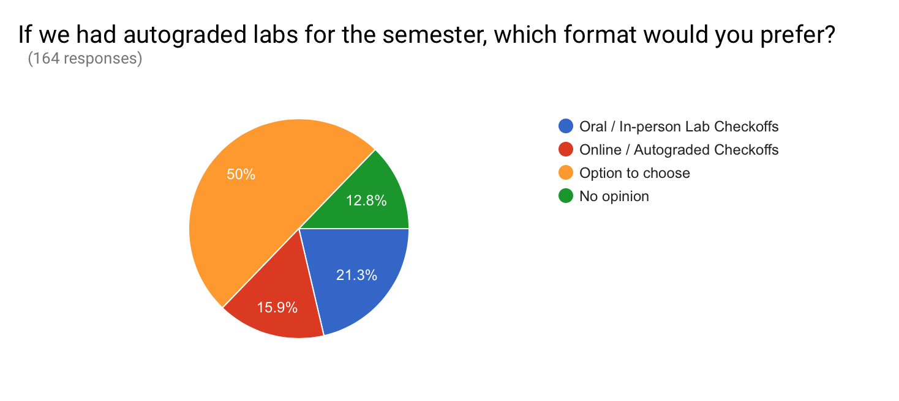

When discussing with TAs this is almost the exact opposite of the results they initially expected. TAs (and instructors, including from other courses) expected almost all students to prefer using the autograder to getting checked off orally. (Ratios some staff suggested were 75/25, 80/20, 90/10 in favor of an autograder. While no one had exactly the same prediction, everyone we spoke to assumed >= 70% students would prefer an autograder.) This validates that we have done a pretty good job in designing and tweaking the oral lab checkoff system (which has evolved over the past few year), but also that students like talking to TAs and that students are not simply trying to beat the system. Instructional staff had concerns about students preferences, because many assumed that the autograder would be the path of least resistance for students. It's worth noting, however that part of the bias towards in-person over online checkoffs could very likely be attributed to bugs in the system early on, but this is still a promising result. (Many open-ended feedback comments mentioned bugs or glitches as a reason for the feelings about the autograder.)

Here is a sampling of comments students gave. Each of these comments is representative of feelings of other students.

> "It would save a lot of time during check off."

> "You get to talk to an actual person! If any questions remain, they can easily be answered!"

> "If I don't finish in class, I am more incentivized to finish it at home instead of at next lab."

> “It worked for me, but I guess doing manual lab check-off was better, in a way, because you get feedback from the TA.”

> “A heads-up would have been nice, as well as something explaining how to use it, but I like this feature a lot. When it works properly, it is very useful and helpful for my learning.”

> “I don't trust it.”

> “The autograde sometimes has bugs. For example, if my code is wrong but sometimes still reported the correct value, it would mark me as a pass.”

Many students preferred the higher fidelity of in person question asking and answering. What’s interesting is that autograded checkoffs wouldn’t prevent students from getting their questions answered. Many students remarked about different levels of stress which come from automated systems or humans. While students didn’t elaborate on *why* they would be more (or less) stressed with an autograder system, the most probable answer is that such a view is really a matter of personal preference. Many students do enjoy that (human) TAs are much more relaxed and comfortable to discuss questions and generally forgiving of errors. In contrast, the autograder (currently) can only provide static responses, and is very brittle when determining correctness. However, some students also noted that they’d prefer not to talk to a TA "unless absolutely necessary" and that they found the automated format easier to deal with. We think this is yet another demonstration that a ‘one-size-fits-all’ model isn't usually the best approach.

When we asked for general feedback about the tool, most of the comments were that it was confusing to use. This is understandable, because in retrospect there was not enough documentation nor TA trailing before the autograder was launched in class. Fortunately, this is a fairly easy problem to address for future semesters.

### Final Survey Feedback
One promising result, is that we asked students for feedback on the overall use of lab checkoffs. While there is (not surprisingly) a large contingent of students who dislike the lab checkoffs, most of the students in support of checkoffs specifically asked for more autograder questions. 

When asked for feedback specific to the autograder, students seemed more positive than they did on the midterm survey. Of the students who had complaints, "bugs" and "glitches" were the biggest reasons. However, as with the midterm survey, there is a large number of students who are very strongly in favor of the opportunity to talk to TAs.

The final questions that we asked mostly backup the data that was collected.

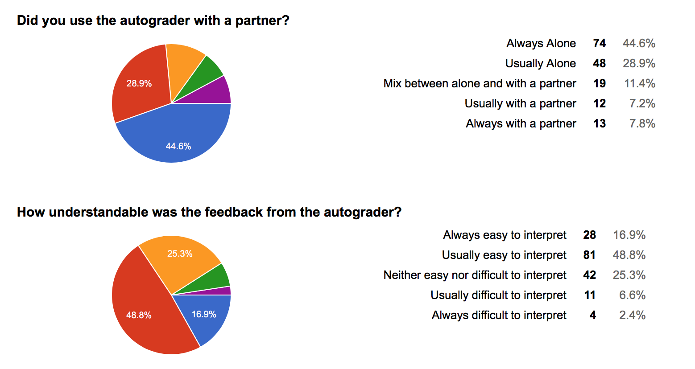

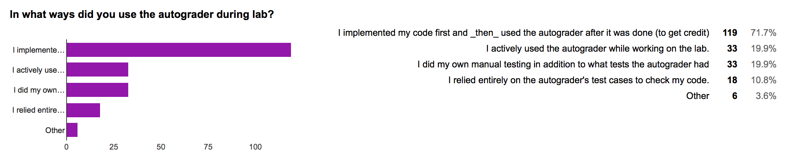

So far these results confirm the data that's been collected. In the future, this suggests TAs can introduce the autograder to students as well as present the motivations for _how_ students should think about using it as a study tool.

